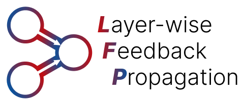

<div align="center">
  
  <p>Gradient-free Neural Network Training based on Layer-wise Relevance Propagation (LRP)</p>
</div>


[](https://badge.fury.io/py/lfprop)

[](https://github.com/astral-sh/ruff)
[](https://pytorch.org/)
[](https://github.com/rachtibat/LRP-eXplains-Transformers)
[](https://github.com/chr5tphr/zennit)

### :octopus: Flexibility
LFP is highly flexible w.r.t. the models and objective functions it can be used with, as it does not require differentiability.
Consequently, it can be applied in non-differentiable architectures (e.g., Spiking Neural Networks) without requiring further adaptations,
and naturally handles discrete objectives, such as feedback directly obtained from humans.

### :gear: Efficiency
LFP applies an implicit weight-scaling of updates and only propagates feedback through nonzero connections and activations. This leads to sparsity of updates and the final model, while not sacrificing performance or convergence speed meaningfully compared to gradient descent. The obtained models can be pruned more easily since they represent information more efficiently.

### :open_book: Paper
For more details, refer to our [Paper](https://arxiv.org/abs/2308.12053).

If you use this package in your research, please cite 
```bibtex
@article{weber2025efficient,
      author={Leander Weber and Jim Berend and Moritz Weckbecker and Alexander Binder and Thomas Wiegand and Wojciech Samek and Sebastian Lapuschkin},
      title={Efficient and Flexible Neural Network Training through Layer-wise Feedback Propagation},
      journal={CoRR},
      volume={abs/2308.12053},
      year={2025},
      url={https://arxiv.org/abs/2308.12053},
      eprinttype={arXiv},
      eprint={2308.12053},
      archivePrefix={arXiv}, 
}
```

### :scroll: License
This project is licensed under the BSD-3 Clause License, since LRP (which LFP is based on) is a patented technology that can only be used free of charge for personal and scientific purposes.

## :rocket: Getting Started


### <a name="installation"></a> :fire: Installation

#### Using PyPI (Recommended)

LFP is available from PyPI, and we recommend this installation if you simply want to use LFP or run any of the notebooks or experiments in this repository.

```shell
pip install lfprop
```

If you would like to check out the ```minimal example.ipynb``` notebook, first clone the repository, and then install the necessary dependencies:
```shell
git clone https://github.com/leanderweber/layerwise-feedback-propagation
cd layerwise-feedback-propagation
pip install lfprop[quickstart]
```

Similarly, if you would like to run the scripts and notebooks for reproducing the paper experiments, you can run
```shell
git clone https://github.com/leanderweber/layerwise-feedback-propagation
cd layerwise-feedback-propagation
pip install lfprop[full]
```
instead to install the full dependencies.

#### <a name="poetryinstall"></a> Using [Poetry](https://python-poetry.org/)

If you would like to contribute to the repository, or extend the code in some way, we recommend the installation via Poetry:

```shell
git clone https://github.com/leanderweber/layerwise-feedback-propagation
cd layerwise-feedback-propagation
poetry install
```

This requires ```poetry-core>=2.0.0,<3.0.0```.

### Overview

Our implementation of LFP is based the LRP-implementation of the [zennit](https://github.com/chr5tphr/zennit) and [LXT](https://github.com/rachtibat/LRP-eXplains-Transformers) libraries. Both of these libraries are based on [PyTorch](https://pytorch.org/) and modify the backward pass to return relevances instead of gradients.

```lfprop``` extends these libraries to return relevances not only w.r.t. activations, but also w.r.t. parameters. Similar to LXT and zennit, this requires registering a composite to modify the backward pass.

*LXT Backend*
```python
from lfprop.propagation import propagator_lxt
propagation_composite = propagator.LFPEpsilonComposite()
```
*Zennit Backend*
```python
from lfprop.propagation import propagator_zennit
propagation_composite = propagator.LFPEpsilonComposite()
```

*SNNs (Also Zennit Backend)*
```python
from lfprop.propagation import propagator_snn
propagation_composite = propagator.LRPRewardPropagator()
```

Instead of an initial relevance, LFP requires an initial reward at the output, to be decomposed throughout the model. We implement several reward functions, with a similar signature to ```torch.nn.Loss``` functions.

```python
from lfprop.rewards import reward_functions as rewards
reward_func = rewards.SoftmaxLossReward(device)
```

To apply the modified backward pass, the composite simply needs to be registered.

After the backward pass is finished, the computed LFP-feedback can then be accessed via the (newly added) ```.feedback``` attribute of each parameter.

The model can simply be optimized using any ```torch.nn.Optimizer```, by first overwriting the ```.grad``` attribute by the corresponding (negative) feedback.

This results in the following training step:

```python
optimizer = torch.optim.SGD(model.parameters(), lr=lr, momentum=momentum)
optimizer.zero_grad()

with propagation_composite.context(model) as modified:
    inputs = inputs.detach().requires_grad_(True)
    outputs = modified(inputs)

    # Calculate reward
    reward = torch.from_numpy(
        reward_func(outputs, labels).detach().cpu().numpy()
    ).to(device)

    # Calculate LFP
    input_reward = torch.autograd.grad(
        (outputs,), (inputs,), grad_outputs=(reward,), retain_graph=False
    )[0]

    # Write LFP Values into .grad attributes.
    for name, param in model.named_parameters():
        param.grad = -param.feedback

    # Optimization step
    optimizer.step()
```

### Examples

A simple, full example of how to train a LeNet model on MNIST can be found under ```minimal_example.ipynb```. Note that to run this notebook, you need to install the necessary dependencies using ```lfprop[quickstart]```, as described under [Installation](#installation).

### :mag: Reproducing Experiments

To reproduce experiments from the paper, you first need to install the necessary dependencies with ```lfprop[full]```, as described under [Installation](#installation).

Most toy data experiments can then be reproduced by simply running the corresponding notebooks under ```nbs/```. You can find the used hyperparameters for the notebooks within the first two cells.

For reproducing the experiments that require training on more complex data and models (LFP for Non-ReLU and Pruning experiments), the training script is implemented in ```run_experiment.py```.
Hyperparameters for these experiments can be generated using the scripts under ```configs/```.

For reproducing the Non-SNN experiments first run
```bash
# 1. generate the config files
python configs/<experimentname>/config_generator<somesuffix>.py
# 2. run training script
python run_experiment.py --config_file=configs/<experimentname>/cluster/<selected-config-name>
```

For the pruning experiments, you can then run the ```nbs/*eval-clusterresults-pruning.ipynb``` notebooks using the obtained models.


For reproducing the SNN experiments run
```bash
# 1. generate the config files
python configs/spiking_neural_networks/config_generator_mnist_training.py
# 2. run training script
python run_snn_experiment.py --config_file=configs/spiking_neural_networks/cluster/<selected-config-name>
```

## :bell: Roadmap

This is a first release of LFP, which does not work with all types of data or models, but we are actively working on extending the package. You can check this Roadmap to get an overview over features planned to the future.

- [x] LFP for CNNs and Fully-Connected Models
- [x] LFP for SNNs
- [ ] LFP for Transformers
- [x] LFP for Classification Tasks
- [ ] LFP for Non-Classification Tasks

## :pencil2: Contributing
Feel free to contribute to the code, experiment with different models and datasets, and raise any suggestions or encountered problems as [Issues](https://github.com/leanderweber/layerwise-feedback-propagation/issues) or create a [Pull Request](https://github.com/leanderweber/layerwise-feedback-propagation/pulls).

For contributing, we recommend the [Installation via Poetry](#poetryinstall).

Note that we use [Ruff](https://github.com/astral-sh/ruff) for formatting and linting.
